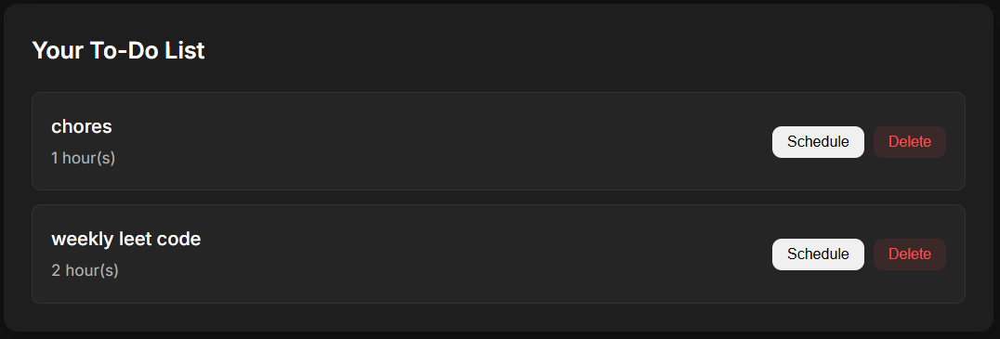

# Bite Size Task Manager


A modern task management application designed to help you break down your work into manageable chunks and schedule them effectively.

## Overview

Bite Size is a productivity tool that helps you organize your tasks by duration and automatically schedules them around your unavailable hours. It integrates with your Google Calendar to ensure all your commitments are in one place.


## Features

### 🔹 Task Management
Add tasks with specific time durations to either schedule immediately or save for later in your to-do list.


### 🔹 Smart Scheduling
Define your unavailable hours so Bite Size knows when not to schedule tasks.


### 🔹 Google Calendar Integration
Tasks are automatically added to your Google Calendar, keeping all your commitments in one place.

### 🔹 To-Do List
Maintain a list of tasks you want to complete but haven't scheduled yet.



## How It Works

1. **Log in with Google** - Connect your Google account to enable calendar integration
2. **Set unavailable hours** - Tell Bite Size when you're not available (sleep, commute, meetings, etc.)
3. **Add tasks** - Enter task name and duration in hours
4. **Schedule or save** - Either add to calendar immediately or save to your to-do list
5. **Manage your time** - Review, reschedule, or delete tasks as needed

## Getting Started

### Prerequisites

- Python 3.6+
- Flask
- Google account
- Internet connection

### Installation

1. Clone the repository:
```bash
git clone https://github.com/KenKapana/Bite-Size.git
cd bite-size
```

2. Install dependencies:
```bash
pip install -r requirements.txt
```

3. Set up environment variables:
```bash
export GOOGLE_CLIENT_ID="your-client-id"
export GOOGLE_CLIENT_SECRET="your-client-secret"
export SECRET_KEY="your-secret-key"
```

4. Run the application:
```bash
flask run
```

5. Open your browser and navigate to `http://localhost:8080`

## Technical Details

Bite Size is built with:

- **Frontend**: HTML, CSS, JavaScript
- **Backend**: Flask (Python)
- **Authentication**: Google OAuth 2.0
- **Data Storage**: Firebase Realtime Database
- **Calendar API**: Google Calendar API

## Use Cases

- **Students**: Schedule study blocks around classes
- **Freelancers**: Manage client projects with time tracking
- **Professionals**: Balance work tasks with personal commitments
- **Anyone**: Who wants to improve their time management skills

## Screenshots

### Dark Mode Interface


### Mobile View


## Roadmap

- [ ] Task categories and tags
- [ ] Analytics dashboard
- [ ] Task dependencies
- [ ] Recurring tasks
- [ ] Collaborative task sharing
- [ ] Mobile application

## Contributing

Contributions are welcome! Please feel free to submit a Pull Request.

1. Fork the repository
2. Create your feature branch (`git checkout -b feature/amazing-feature`)
3. Commit your changes (`git commit -m 'Add some amazing feature'`)
4. Push to the branch (`git push origin feature/amazing-feature`)
5. Open a Pull Request

## License

This project is licensed under the MIT License - see the LICENSE file for details.

## Acknowledgements

- [Google Calendar API](https://developers.google.com/calendar)
- [Flask Framework](https://flask.palletsprojects.com/)
- [Inter Font Family](https://fonts.google.com/specimen/Inter)

---

Made with ❤️ by Ken Kapana